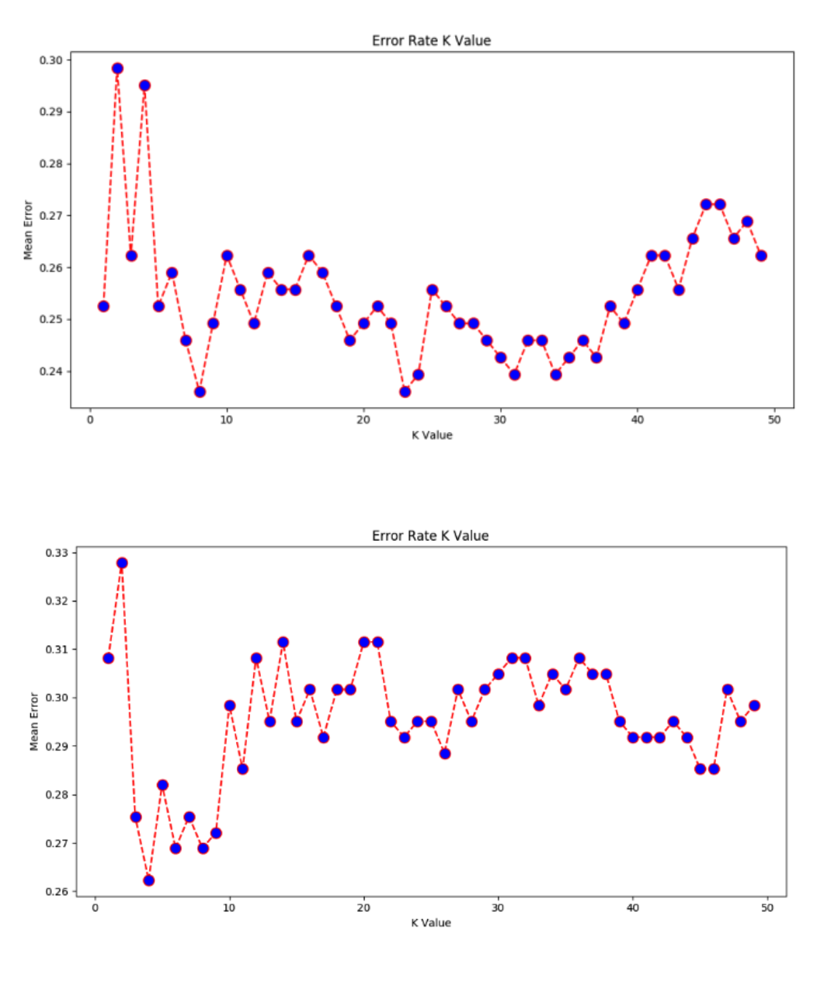

# US Presidential Data Analysis

## Introduction
This project involves analyzing data from US Presidential elections. The dataset contains statistics on wins and losses, with 13 features including sentiment analysis, future and past references, and more.

## Dataset Description
The dataset is split into training and testing sets. The features include:
1. Ratio of positive to negative words.
2. Number of times the candidate's party name is mentioned.
3. Number of times the opponent's party name is mentioned.
4. Measures of speech content including clarity, conscience, extroversion, agreeableness, and emotional stability.

## Analysis
### 1NN Algorithm
The 1NN algorithm was used to classify the training data, resulting in a classification error rate of 0%. However, this did not translate to the test data, where the error rate was approximately 31%.

### KNN Algorithm
The KNN algorithm was tested with different values of k to observe its impact on classification error. The results showed that k values between 1 and 4 were not suitable, while values between 11 and 21 provided a better balance, resulting in lower error rates.

## Results
The following images show the error rates for different k values in the KNN algorithm:

As observed, the error rate decreases as k increases, reaching a more stable range between 11 and 21.

This zoomed-in view highlights the optimal range for k, where the error rate is minimized.

## Conclusion
The analysis demonstrated the importance of choosing the right value for k in the KNN algorithm. While a 1NN approach resulted in perfect classification on the training data, it did not generalize well to the test data. A balanced value of k, between 11 and 21, provided a more accurate classification on the test data.
